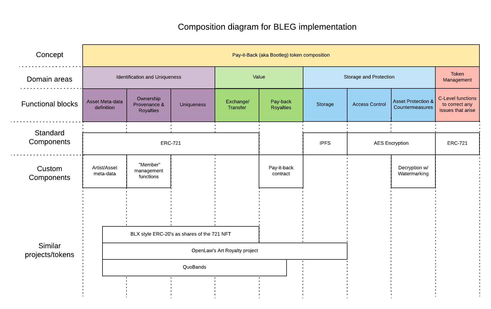
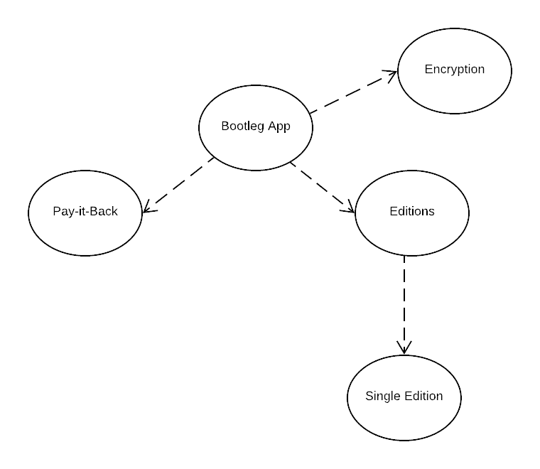
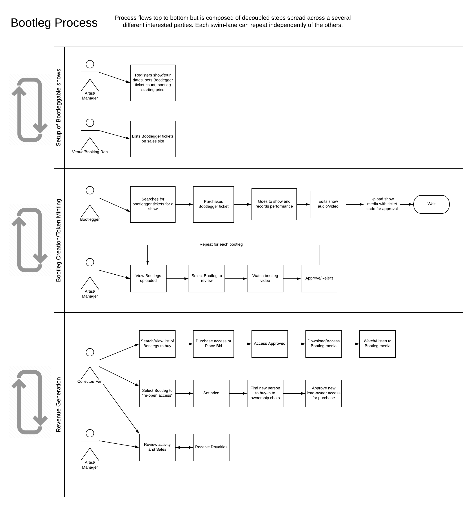
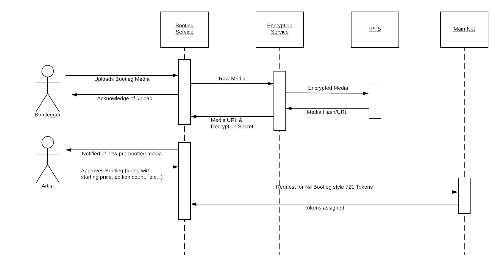

<h1 align="center">
   
  
   
</h1>

<h4 align="center">
  Steal this Code
</h4>

  <a href="#packages">Packages</a>
  <a href="#architecture">Architecture</a>
  <a href="#license">License</a>

Welcome to the near future. This repo is the home of **Bootleg** 👢🦵. This is
the latest project from the [Consensys Web3Studio](https://consensys.net/web3studio/) team.
We are beginning development on this exciting new idea and you can follow the
latest updates here through GitHub. Please join the discussion, create issues, and get involved!

Read more about the project in the latest article about Bootleg on [Medium](https://link.medium.com/ZgnzmtPMrT)

## Project overview

This repo holds the code and development assets for the Bootleg SDK. The repo and many of the high level concepts in this project all pay homage to the original article about the idea published on Medium (link above). Whenever possible we have attempted to use more generic terms in our code and domain models so that as much code from this repo can be re-used, shared, re-purposed by anyone. We have done our best but it is a tradeoff between making something we feel embodies the spirit of the idea and speculating about would/would not be useful should someone decided to take our code and run with it.

## Packages

This is a monorepo that contains the projects that make bootleg rock 🎸. You can find
the code for all of them in in the [`packages`](packages) folder.

You'll notice two prefixes. `bootleg` projects are directly related to the fictional
bootleg app, or the smart contracts it uses. `helix` projects are related to a system to
create non-transferable digital native assets, basically blockchain DRM.

### [`bootleg-tokens`](packages/bootleg-tokens)

This is where you can find the smart contracts for the bootleg token itself. This is where you
would want to look if you want to use our pay-it-backwards tokens in your dApp.

### [`bootleg-app-contracts`](packages/bootleg-app-contracts)

Here lies the smart contracts used by our fictional app. It's a great reference
implementation for your Bootleg-esk dApp.

### [`helix-crypto`](packages/helix-crypto)

Where the rubber hits the road. A phenomenal library to encrypt and then cryptographically
watermark an asset to allow copyright holders to find who leaked their content.

### [`helix-contracts`](packages/helix-contracts)

Reference contracts that the Helix system uses to make everything trustless.

### [`examples`](packages/examples)

Everything comes together here. This is a simulated environment where you can see how to wire
everything up and even tweak with some parameters for your dApp.

## Architecture

_Disclaimer: The purpose of the work here is to inspire others to try and implement something like what we've described. Building a full working system of this level of complexity would require a non-trivial amount of work. We believe the information here represents our best-guess at what we might build should we have the time/resources to do so. Our hope is that you will find parts of this project inspiring or thought provoking enough to dig in and experiment on your own. We are open to any questions, comments, feedback but keep in mind that this is a work of fiction._

### System Components

We are **imaging** that the system to support the story defined in Bootleg would be composed of multiple systems. **WE ARE NOT BUILDING ANY OF THESE IN THE SDK**. However, they might be useful and/or part of an actual implementation of a Bootleg-like product in some way. Documenting them here helps us (as developers of the SDK) focus on important technical parts of the system knowing that the packages we created (listed above) have their place in the large system whole. The imagined systems are as follows:

#### Mobile/Web Apps

**Fan App** - The fan app will allow people to access and view the bootlegs created by the Bootleggers in the system. It will function similarly to a music store but instead of buying to own the bootlegs you are buying access and future royalties on sales. Through the fan app you would be able to search for artists you like, see the latest popular Bootlegs, gain access and watch audio/video of the concert. There is also a social component where you can connect with other fans, bootleggers, and artists on the platform.

**Bootlegger App** - Used during the concert, the app would allow the person creating the Bootleg to capture the audio/video recording of the concert. It would support all the functions around requesting access to the band to become a bootlegger for them, handling any royalty agreements, promoting your existing Bootlegs through the platform, and connecting with fellow Bootleggers at/around the concert you are attending. Note: This app is also built to support desktop use so audio/video files can be edited using traditional DAW/Non-linear editing software.

**Artist App** - Primarily used for approving the bootlegs that have been submitted by the Bootlegger. This app would also be used for updating the artists page, communicating with Bootleggers. It has integrations with social media (Twitter, Facebook, Patreon, etc...) to reach out to fans and promote their concerts.

**Bootlegger Systems** - The fictional company behind the Bootlegger product would need a management system. This system would be composed of several web-apps/services that would cover the following:

- Approving new Bootleggers and Artists, management of their profiles, bootlegs, and any administration around royalty payments.
- Management of Bootleg artifacts and sales
- System for resolution of any disputes around ownership/access 
- Ticketing system for issues with the quality of the Bootleg video/audio, access to decrypted videos, etc... (e.g. re-uploading a file, adjusting payouts, removing bad-actor members, offensive content, etc...)

### Ethereum

The Bootleg system runs on Ethereum through the use of custom Smart Contracts and a 721 compliant tokens.

#### Token Design

#### Smart Contracts

### General System Flow

### Bootleg Creation Sequence

## License

As per usual, we are publishing under the [Apache 2.0 License](LICENSE).
