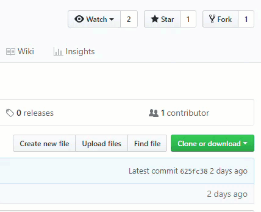

# Welcome to the near future :sparkles:
This repo is the home of :boot: **Bootleg**. This is the latest project from the [Consensys Web3Studio](https://consensys.net/) team. We are begining development on this exciting new idea and you can follow the latest updates here through GitHub. Please join the discussion, create issues, and get involved!

Read more about the project in the [latest article about Bootleg on Medium](https://link.medium.com/ZgnzmtPMrT)

## :eyes: Watch this space!
No really, *watch it*... click the Watch button to stay on top of the latest changes. 

### :scroll: License
As per usual, we are publishing under the [Apache 2 License](LICENSE).

### Project Nutshell -- What we're exploring right now and where to find the work:

The bootleg project is primarily about embodying a token design pattern we call "pay-it-backward" into a user experience that shows the unique capabilities of the pattern in a way that is compelling and potentially worth pursuing by any number of organizations as a new venture. At the very least, the embodyment should inspire and expand the the perspective of developers, designers and entrepreneurs and hopefully lead to derivative ideas or entirely new ideas leading to unique and powerful new ventures.

The following is the big picture of the project and our way of keeping track of the epics and issues in this project as a snapshot with links to the key epics (and some issues).

#### [Pay It Backward Token](https://github.com/ConsenSys/web3studio-bootleg/issues/5)

#### [Bootleg User Experience](https://github.com/ConsenSys/web3studio-bootleg/issues/9)

#### Bootleg [DeveloperKit](https://github.com/ConsenSys/web3studio-bootleg/issues/12)

#### Bootleg [Presentation to SXSW](https://github.com/ConsenSys/web3studio-bootleg/issues/8)

