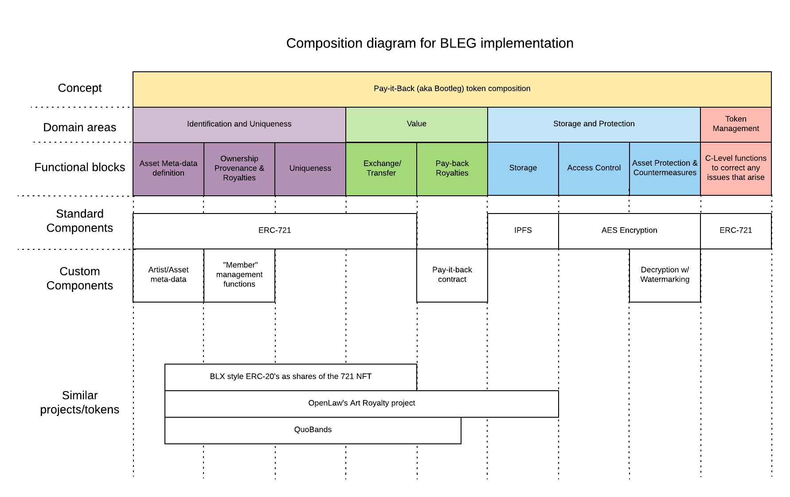
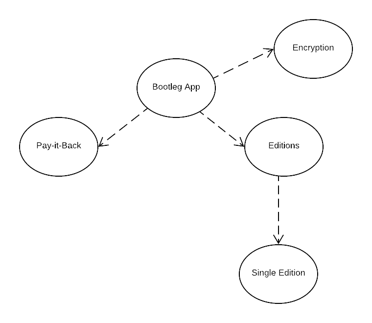
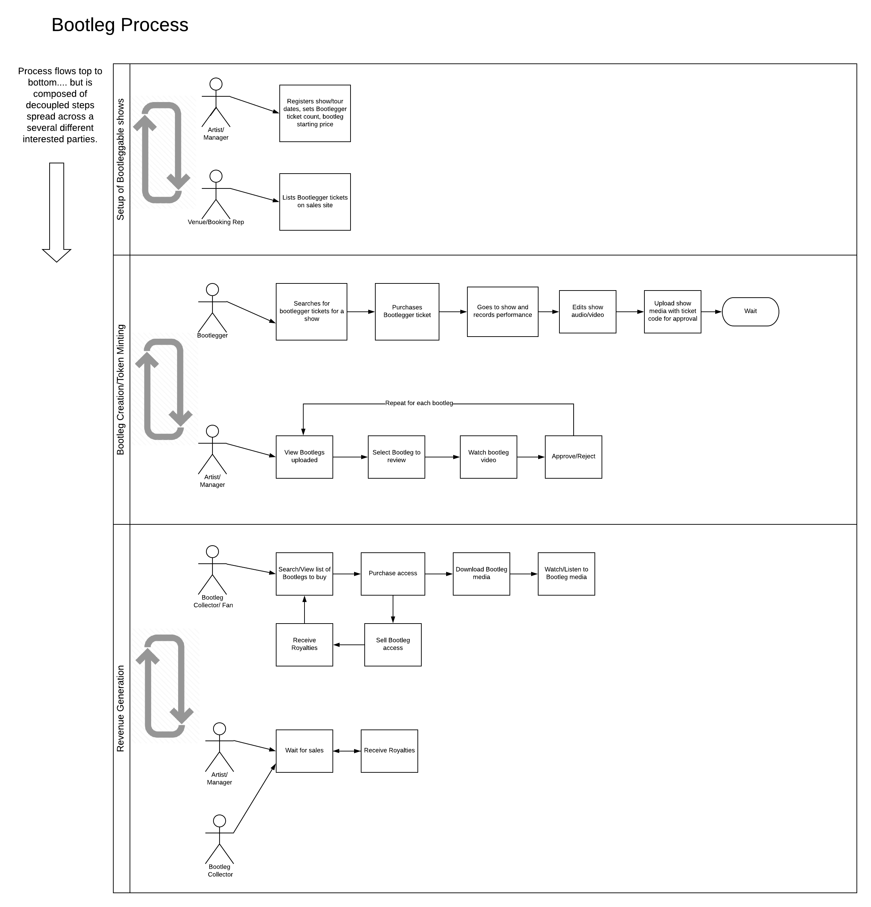
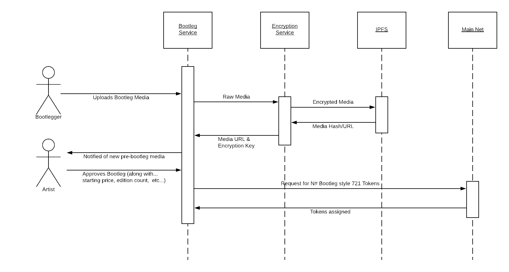

# Bootleg Architecture Documentation

Disclaimer: The purpose of the work here is to inspire others to try and implement something like what we've described. Building a full working system of this level of complexity would require a non-trivial amount of work. We believe the information here represents our best-guess at what we might build should we have the time/resources to do so. Our hope is that you will find parts of this project inspiring or thought provoking enough to dig in and experiment on your own. We are open to any questions, comments, feedback but keep in mind that this is a work of fiction.

## System components

We are imaging that the system to support the story defined in Bootleg would be composed of multiple systems. The systems are as follows:

### Mobile Apps

Fan App - The fan app will allow people to access and view the bootlegs created by the Bootleggers in the system. It will function similarly to a music store but instead of buying to own the bootlegs you are buying access and future royalties on sales. Through the fan app you would be able to search for artists you like, see the latest popular Bootlegs, gain access and watch audio/video of the concert. There is also a social component where you can connect with other fans, bootleggers, and artists on the platform.

Bootlegger App - Used during the concert, the app would allow the person creating the Bootleg to caputer the audio/video recording of the concert. It would support all the functions around reqesting access to the band to become a bootlegger for them, handling any royalty agreements, promoting your existing Bootlegs through the platform, and connecting with fellow Bootleggers at/around the concert you are attending. Note: This app is also built to support desktop use so audio/video files can be edited using traditional DAW/Non-linear editing software.

Artist App - Primarily used for approving the bootlegs that have been submitted by the Bootlegger. This app would also be used for updating the artists page, communicating with Bootlegers. It has integrations with social media (twitter, facebook, Patreon) to reach out to fans and promote their concerts.

### Web/Service Apps

Bootlegger systems - The fictional company behind the Bootlegger product would need a management system. This system would be composed of several web-apps/services that would cover the following:

- Approving new Bootleggers and Artists, management of their profiles, bootlegs, and any administration around royalty payments.
- Management of Bootleg artifacts and sales
- Tracking of member access to Bootlegs and payments of royalties
- Management of crypto-wallets on behalf of any Bootlegger fans,artists,bootlegers
- System for resolution of any disputes or isses with the quality of the Bootleg video/audio, access to decrypted videos, etc... (e.g. re-uploading a file, adjusting payouts, removing bad-actor members, offensive content, etc...)

## Ethereum

The Bootleg system runs on Ethereum through the use of Smart Contracts and a 721 compliant token.

### Token Design

### Smart Contracts

## General System Flow

## Bootleg Creation Sequenc
